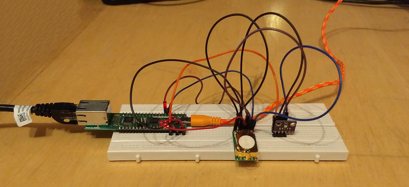
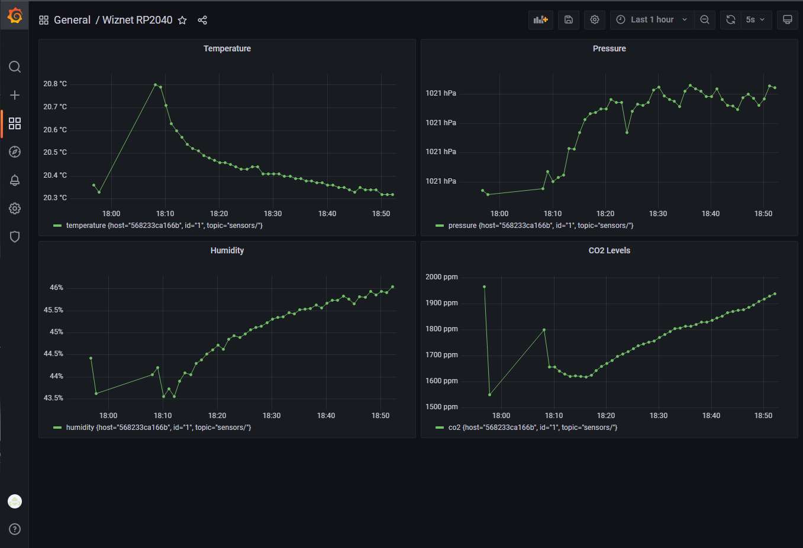
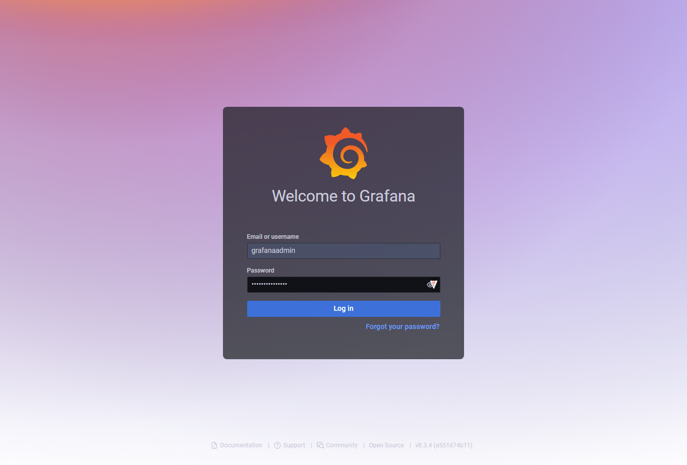
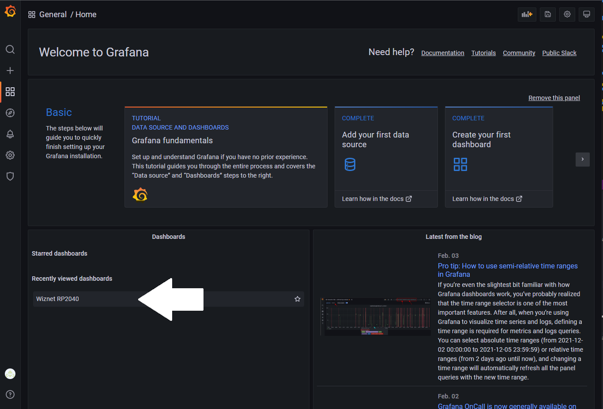

#  WIZnet Ethernet HAT Contest 2022
## Ethernet Connected Environmental Sensor
## by Nico Maas (2022)

## Overview
The following project pairs an W5100S-EVB-Pico with a Bosch BME280, Telaire T6713 and passive PoE injector to allow for an ethernet powered environmental sensor which can register temperature, humidity, air pressure and CO2 levels.
The setup is completed with a deployment ready Mosquitto / Telegraf / InfluxDB / Grafana stack to record and visualize the data, which will be sent by the sensor every minute.





## Hardware
Within the Hardware directory you'll find a readily made EasyEDA project (https://easyeda.com/) which can be imported and then produced by the EasyPCB service.

Other than the PCB, you'll need

* 1x W5100S-EVB-Pico
* 1x BME280 module
* 1x Telaire T6713
* 2x 16V 10uF 0603 10uF Multilayer Ceramic Capacitors MLCC
* 1x HT7350-1
* 1x passive PoE Kit [e.g. this one](https://www.digitus.info/produkte/aktive-netzwerkkomponenten/power-over-ethernet-poe/poe-splitter/dn-95001/?PL=es)
* 1x 12V power supply

The assembly should be straight forward, just mount the components. Please be advised that the PoE power supply and USB Micro connector are not allowed to be plugged in at the same time, as this could harm the RP2040. The idea of the passive PoE is following: The "injector" part is providing network and 12V power to the cable running to your RP2040, the "receiver" is stripping the 12V power and leading them onto the PCBs PoE Power in, which will use the HT7350 LDO to reduce it to 5V. Also, the "power stripped" ethernet can be connected to the RP2040. 12V is used to allow for long cable runs, as DC power will drop sharply depending on the length of the run.

## Software

### Arduino

#### used libraries

* [earlephilhower arduino-pico](https://github.com/earlephilhower/arduino-pico) @ 1.19.3
* [WIZnet-ArduinoEthernet](https://github.com/WIZnet-ArduinoEthernet/Ethernet) @ master
* [256dpi Arduino-MQTT](https://github.com/256dpi/arduino-mqtt) @ 2.5.0
* [Adafruit BME280](https://github.com/adafruit/Adafruit_BME280_Library) @ 2.2.2
* [ArduinoJson](https://github.com/bblanchon/ArduinoJson) @ 6.19.1

#### re-used examples

* DhcpAddressPrinter (WIZnet-ArduinoEthernet)
* ArduinoEthernetShield (Arduino-MQTT)
* bme280_unified (Adafruit BME280)
* [TelAire T6713 Application Note](https://paramair.de/app/uploads/2018/01/Amphenol-Application-note-T6713-CO2-Module.pdf) - I2C part

#### Setup

* Install the needed libraries above
* Download and open the Software/RP2040_Sensor/RP2040_Sensor.ino
* Scroll to the user settings area

````
// User settings to configure
// Sensor ID (set to different if multiple sensors in the network)
byte id = 1;
// Enter the IP of the Mosquitto Server
IPAddress server(192, 168, 4, 115);
// Enter a MAC address for your Wiznet RP2040 below
byte mac[] = {
  0x00, 0xAA, 0xBB, 0xCC, 0xDE, 0x02
};
````

* Adjust the variables to your needs
  * id / Sensor ID: change it if you got multiple sensors (however, the prepared visualization is set to id 1)
  * server: change the IP address to your server / where the sensor data should be forwarded to
  * mac: change to a suitable MAC address for your network
* Flash to your RP2040 with Arduino set to the correct board type (WIZnet W5100S-EVB-Pico) and Speed (130 MHz) - with the PoE splitter not attached
* After that, you can disconnect the Micro USB cable and attach the board to the PoE splitter and power it with 12V

### Docker

#### Setup

* Download the Software/Docker_MTIG folder
* Install and prepare Docker and Docker-Compose on your machine
* Navigate into the folder
* Before first launch, you can alter the provisioned variables in the ````configuration.env````, e.g. for username and password
* Execute ````docker-compose up```` - this will start up the container provisioning
* After some minutes, navigate to http://127.0.0.1:3000/
* You'll need to login with the Grafana Admin Login credentials (e.g. grafanaadmin/grafanapassword)

* Click on the "Wiznet RP2040" entry of "Recently viewed dashboard"

* Enjoy the view at your data


### Troubleshooting

* Make sure no firewall is blocking the communication between RP2040 and Mosquitto
* You can always just connect non-powered ethernet to your RP2040 and the Micro USB cable to watch for debug messages on the serial console
